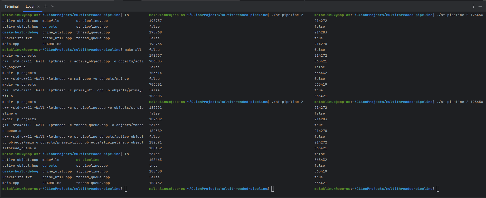

# Multi-threaded Pipeline

This is a C++ project that implements a multi-threading pipeline of Active Objects (AOs) that manipulate numbers. Each
AO performs a specific operation on the input number and passes the result to the next AO in the pipeline. The pipeline
supports synchronization and mutual exclusion between the threads of the AOs.

---

## Project Structure

### Classes

* **primeUtil**: A utility class that provides a static method to check if a given number is a prime number.

* **ThreadQueue**: A thread-safe queue that stores `void*` elements. This queue is used by the Active Objects to hold
  their tasks.

* **ActiveObject**: This class represents an Active Object that performs a specific operation on the input number and
  passes the result to the next Active Object in the pipeline. An Active Object has its own thread and uses a
  ThreadQueue to store tasks.

* **PipelineST**: This class represents the pipeline of the Active Objects. It initializes and manages the Active
  Objects and provides an `execute` method to start the pipeline.

* **Main Function**: The main function takes command-line arguments and starts the pipeline.

---

## How to Compile and Run

### You can compile the project using the provided makefile:

```bash
$ make all
```

or

```bash
$ make default
```

This will produce an executable named `st_pipeline`.

### To run the pipeline, use the following command:

```bash
$ ./st_pipeline [N] [seed]
```

Where:

- `N` is the number of tasks that the pipeline will perform.
- `seed` is an **optional** argument that specifies the seed for the random number generator. If no seed is provided, a
  default random seed is used.

---

## Examples

To perform 2 tasks with a default seed, run `./pipeline_st 2`:

```bash
$ ./pipeline_st 2
499140
false
499151
true
499138
false
499140

891875
false
891886
false
891873
false
891875
```

To perform 2 tasks with a specific seed, run `./pipeline_st 2 123456`:

```bash
$ ./pipeline_st 2 123456
214272
false
214283
true
214270
false
214272

563421
false
563432
false
563419
true
563421
```

Same random seed generates the same sequence of pseudo-random numbers.

---

## ScreenShot


---

## Cleaning Up

You can clean up the compiled files with the command:

```bash
make clean
```

This will remove the executable and all .o files in the `objects` directory.